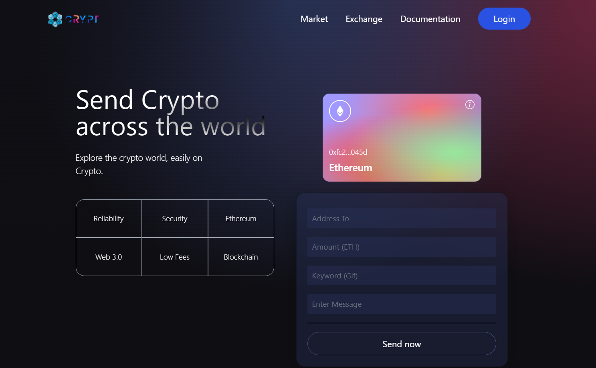
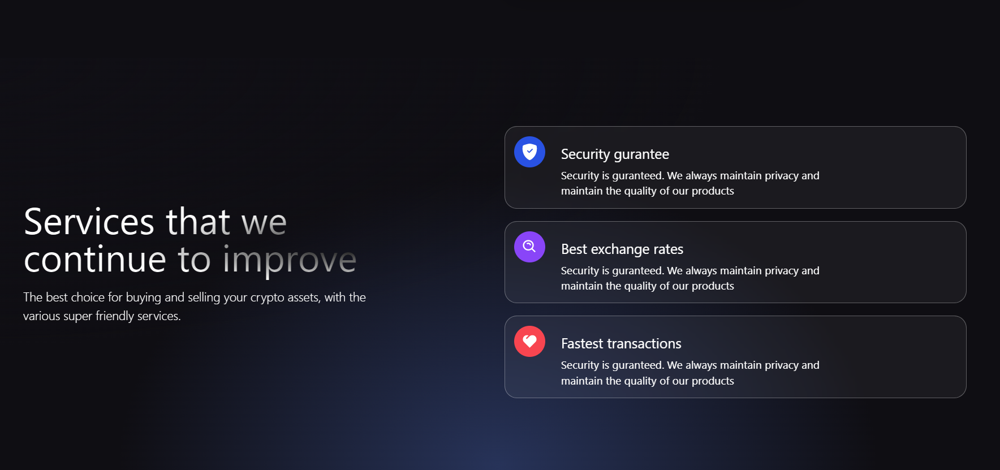

# CRYPT- Send Crypto Across The World

Created a Web 3.0 application to send cryptos through wallets by connecting Metamask wallets to the web application.

The transactions which take place through the platform can be backtracked with the integration of Etherscan's with the web application.
The application is integrated with the ability to send a GIF as well as a message with the transaction that is about to be performed. 
Documentation and Crypto market links are integrated to keep a check on the transaction fees and trading volumes.

## Application Demo Screenshots :

